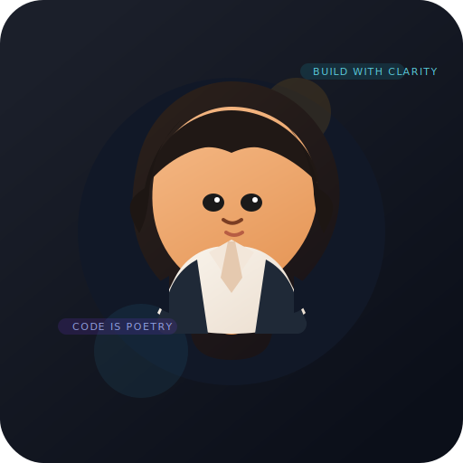

 

<table>
<tr>
<td width="68%" valign="top">

## About

I build AI-first products and polished web interfaces with a focus on clarity, speed, and practical outcomes. My current work sits at the intersection of GenAI, agent orchestration, and modern frontend engineering.

 

**Current focus**

- Agentic workflows with LangGraph and LangChain
- Retrieval systems, RAG, and vector search
- FastAPI, React, Next.js, and TypeScript product builds
- Clean UX patterns that feel professional, not noisy

**Open to**

- GenAI internships
- Open source collaboration
- Research-driven product work

</td>
<td width="32%" valign="top" align="center">

 
A custom avatar inspired by your anime profile picture.

</td>
</tr>
</table>

---

## Snapshot

<table>
<tr>
<td width="33%" valign="top">

### Build
- Multi-agent systems
- AI research assistants
- Full-stack dashboards
- Document intelligence

</td>
<td width="33%" valign="top">

### Learn
- Advanced LangGraph patterns
- Vector database tuning
- Production deployment
- Better evaluation loops

</td>
<td width="33%" valign="top">

### Work Style
- Practical over flashy
- Clean architecture
- Product-minded execution
- Detail-oriented UI

</td>
</tr>
</table>

---

## Stack

---

## Selected Work

<b>Multi-Modal Document Intelligence</b>

 

A multi-agent document understanding system designed for layout analysis, OCR, validation, and retrieval across structured content.

 

<b>Helios AI Research Agent</b>

 

An autonomous research assistant with live web retrieval, fast inference, and an interactive Streamlit interface.

 

<b>Money-Mate Dashboard</b>

 

A modern finance dashboard built to make budgets, expense tracking, and analytics feel simple and approachable.

---

## GitHub Pulse

<a href="https://github.com/gopika-repo">
  
  &nbsp;&nbsp;
  
</a>

  

  

---

## Connect

  

